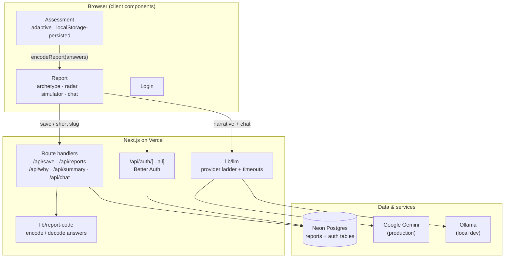
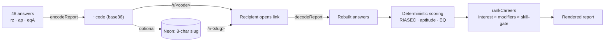
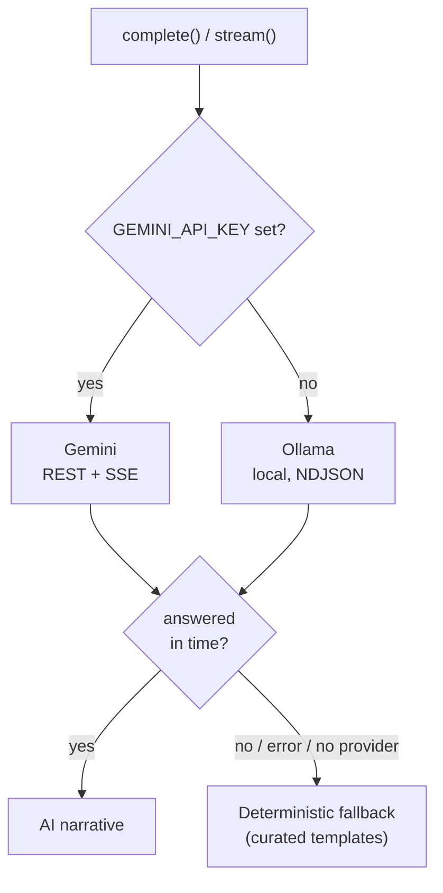
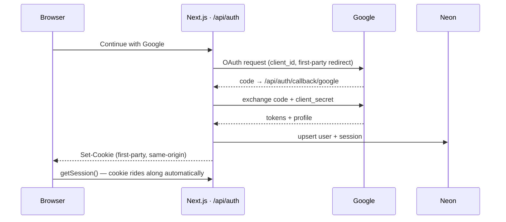

# Rahi

An AI career-counselling web app for students. It measures the three things that
actually decide fit — **interests, aptitude, and emotional strengths** — then turns
them into an honest, evidence-backed report of careers, courses, entrance exams, and
next steps. Not a personality quiz that flatters you.

**Live:** https://rahi-fawn.vercel.app

---

## Highlights

- **Adaptive assessment** — 48 questions per attempt, freshly sampled from a larger bank
  so retaking never repeats the same list; the aptitude section adjusts difficulty to
  each answer, and progress survives a refresh via `localStorage`.
- **Curated facts, AI narrative** — a hard boundary: salaries, universities, employers,
  and courses come only from hand-checked data; the LLM writes the personalised prose and
  is never allowed to invent facts.
- **Database-optional reports** — a report is fully determined by its answers, so it's
  encoded into the share URL itself. Links work with or without the backend.
- **First-party auth** — Better Auth runs inside the app, so sessions survive ad blockers
  and third-party-cookie blocking.
- **Graceful degradation** — the app is fully usable with no AI key and no database;
  features light up as services are configured. Upstream AI calls are timeout-bounded.

---

## Architecture



### 1. The report is its own database

The most load-bearing design decision: a report is a pure function of its 48 answers, so
instead of persisting every result we **encode the answers into the URL**. The database is
an optional convenience layer (short links + a per-account history), never a requirement.



The share code is **versioned** (a `~` prefix stores real question ids, since each attempt
samples a different subset); legacy positional codes still decode.

### 2. Scoring & fusion

Three signals are fused into a ranked career list. Interest is the **primary multiplier**;
aptitude and EQ modulate it; a **skill-gate** demotes careers that require an aptitude the
student lacks — so a verbal-zero profile stops ranking Sales #1.

| Signal | Instrument | Notes |
|--------|-----------|-------|
| Interests | RIASEC / Holland (6 types) | 4 items per type, sampled from an 8-per-type bank |
| Aptitude | numerical · verbal · logical | **adaptive**: right answer → harder next; difficulty-weighted scoring |
| Emotional | Goleman-style EQ domains | reverse-keyed, with a consistency check that flags contradictory answers |

### 3. The AI layer

A single abstraction (`lib/llm`) picks the best available provider and degrades gracefully.
Every upstream call is timeout-bounded so a hung provider fails fast to the deterministic
fallback rather than holding the request open.



The guardrail never moves: the model only writes the personalised narrative. Reference
facts come exclusively from `lib/enrichment` and are never AI-generated.

### 4. Auth (first-party sessions)

Auth runs **inside the app** at `/api/auth`, on the app's own domain — so the session
cookie is first-party and isn't stripped by ad blockers or third-party-cookie blocking
(the root cause of an earlier "login won't stay logged in" bug). It uses the same Neon
database in its own tables.



---

## Tech stack

| Layer | Choice |
|-------|--------|
| Framework | Next.js 16 (App Router, Turbopack), React 19, TypeScript |
| Styling | Tailwind CSS v4 (custom cobalt/coral scales), Fraunces + Inter |
| Database | Neon Postgres (`@neondatabase/serverless`) |
| Auth | Better Auth (self-hosted, email + Google OAuth) |
| AI | Google Gemini (prod) · Ollama (dev) · deterministic fallback |
| Hosting | Vercel, auto-deploy from `main` |

## Repository layout

```
app/            App Router routes
  assessment/   the adaptive quiz (client)
  r/[code]/     shared report (decodes a share code or DB slug) + /parent view
  reports/      per-account / per-device history
  api/          route handlers (save, reports, why, summary, chat, auth)
components/     Report, Simulator, RiasecRadar, GrowthChart, Chat, RahiBot, …
lib/            scoring & domain logic (framework-free, self-checked)
  riasec · aptitude · eq        assessment instruments + scoring
  careers · enrichment          31 careers + curated reference data
  report-code                   URL state encode/decode
  llm                           provider ladder + timeouts
  auth · auth-server · auth-client   Better Auth wiring
```

---

## Getting started

Requires **Node 22+**.

```bash
npm install
cp .env.example .env.local   # fill in the values you need (all optional — see below)
npm run dev                  # http://localhost:3000
```

Everything is optional in `.env.local`:

- **No env at all** — the app runs; reports work via URL encoding, AI features show their
  deterministic fallback, and saved-report history is disabled.
- **`DATABASE_URL`** (Neon) — enables short links and saved-report history.
- **`BETTER_AUTH_SECRET` + `BETTER_AUTH_URL`** — enables email login; add
  `GOOGLE_CLIENT_ID` / `GOOGLE_CLIENT_SECRET` for Google.
- **AI** — set `GEMINI_API_KEY` for hosted AI, or run a local [Ollama](https://ollama.com)
  model for dev (`OLLAMA_MODEL`, default `llama3.2`).

For Google OAuth, register `<BETTER_AUTH_URL>/api/auth/callback/google` as an authorized
redirect URI.

## Testing & CI

Domain logic is guarded by a **framework-free self-check** — no test runner, no fixtures:

```bash
node lib/riasec.selfcheck.ts   # scoring, fusion, adaptive difficulty, encoding round-trip, enrichment coverage
```

GitHub Actions runs the self-check and a full type-checked build on every push and pull
request (`.github/workflows/ci.yml`), so a broken build or failing check blocks the merge.

## Deployment

Hosted on Vercel with auto-deploy from `main`. Set the same environment variables in the
Vercel project (Production), and set `BETTER_AUTH_URL` to the deployed origin.
