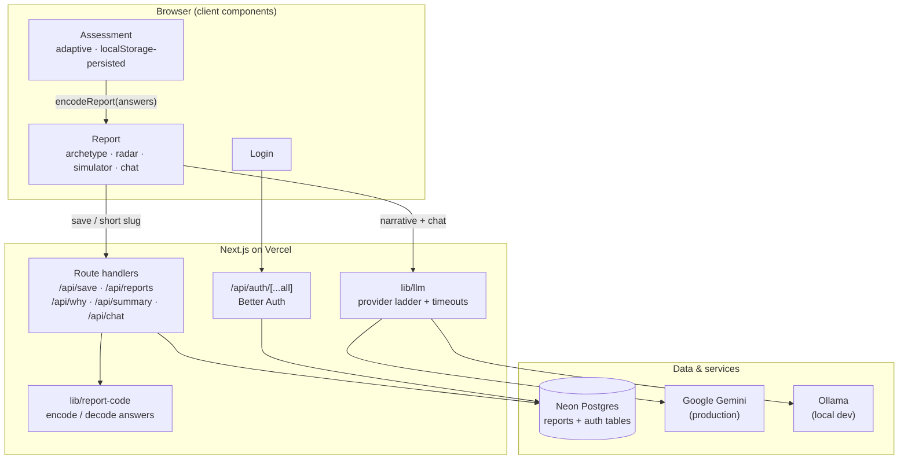
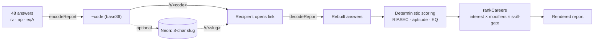
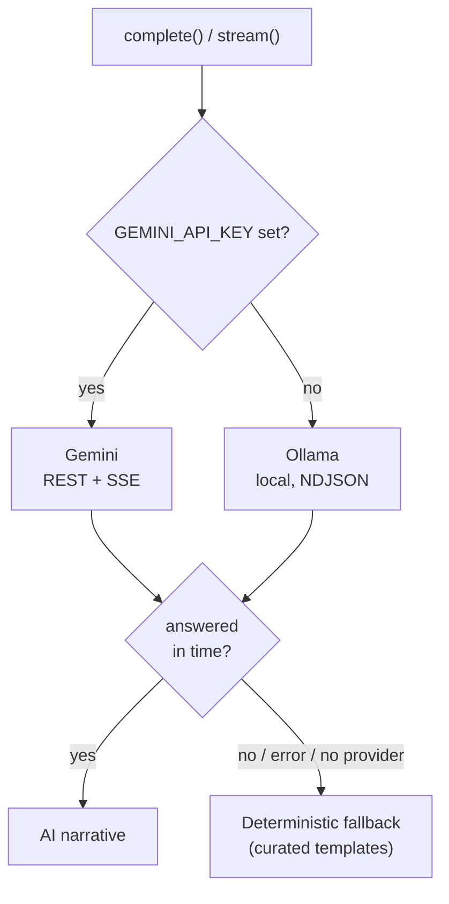
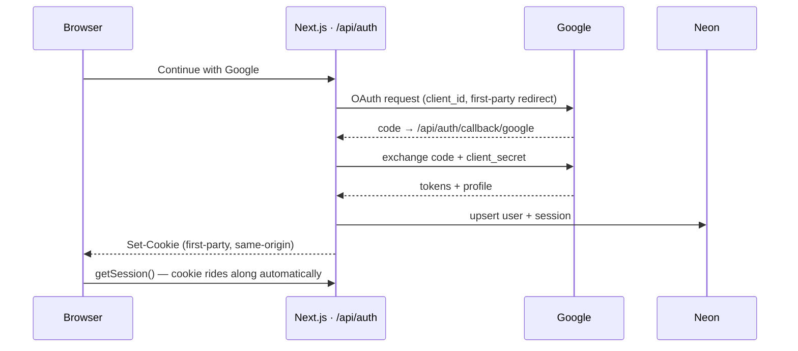

# Rahi

An AI career-counselling web app for students. It measures the three things that
actually decide fit — **interests, aptitude, and emotional strengths** — then turns
them into an honest, evidence-backed report of careers, courses, entrance exams, and
next steps. Not a personality quiz that flatters you.

**Live:** https://rahi-fawn.vercel.app

---

## Highlights

- **Adaptive assessment** — 48 questions per attempt, freshly sampled from a larger bank
  so retaking never repeats the same list; the aptitude section adjusts difficulty to
  each answer, and progress survives a refresh via `localStorage`.
- **Curated facts, AI narrative** — a hard boundary: salaries, universities, employers,
  and courses come only from hand-checked data; the LLM writes the personalised prose and
  is never allowed to invent facts.
- **Database-optional reports** — a report is fully determined by its answers, so it's
  encoded into the share URL itself. Links work with or without the backend.
- **First-party auth** — Better Auth runs inside the app, so sessions survive ad blockers
  and third-party-cookie blocking.
- **Graceful degradation** — the app is fully usable with no AI key and no database;
  features light up as services are configured. Upstream AI calls are timeout-bounded.
- **Portable, not platform-locked** — ships as a multi-stage Docker image built on
  Next.js `standalone` output, so it runs on any Kubernetes/OpenShift cluster, not just
  Vercel. CI (lint + type-checked build + Playwright) runs on standard GitHub Actions.

---

## Architecture



### 1. The report is its own database

The most load-bearing design decision: a report is a pure function of its 48 answers, so
instead of persisting every result we **encode the answers into the URL**. The database is
an optional convenience layer (short links + a per-account history), never a requirement.



The share code is **versioned** (a `~` prefix stores real question ids, since each attempt
samples a different subset); legacy positional codes still decode.

### 2. Scoring & fusion

Three signals are fused into a ranked career list. Interest is the **primary multiplier**;
aptitude and EQ modulate it; a **skill-gate** demotes careers that require an aptitude the
student lacks — so a verbal-zero profile stops ranking Sales #1.

| Signal | Instrument | Notes |
|--------|-----------|-------|
| Interests | RIASEC / Holland (6 types) | 4 items per type, sampled from an 8-per-type bank |
| Aptitude | numerical · verbal · logical | **adaptive**: right answer → harder next; difficulty-weighted scoring |
| Emotional | Goleman-style EQ domains | reverse-keyed, with a consistency check that flags contradictory answers |

### 3. The AI layer

A single abstraction (`lib/llm`) picks the best available provider and degrades gracefully.
Every upstream call is timeout-bounded so a hung provider fails fast to the deterministic
fallback rather than holding the request open.



The guardrail never moves: the model only writes the personalised narrative. Reference
facts come exclusively from `lib/enrichment` and are never AI-generated.

### 4. Auth (first-party sessions)

Auth runs **inside the app** at `/api/auth`, on the app's own domain — so the session
cookie is first-party and isn't stripped by ad blockers or third-party-cookie blocking
(the root cause of an earlier "login won't stay logged in" bug). It uses the same Neon
database in its own tables.



---

## Tech stack

| Layer | Choice |
|-------|--------|
| Framework | Next.js 16 (App Router, Turbopack), React 19, TypeScript |
| Styling | Tailwind CSS v4 (custom cobalt/coral scales), Fraunces + Inter |
| Database | Neon Postgres (`@neondatabase/serverless`) |
| Auth | Better Auth (self-hosted, email + Google OAuth) |
| AI | Google Gemini (prod) · Ollama (dev) · deterministic fallback |
| Hosting | Vercel (managed) **or** any container orchestrator (Docker → Kubernetes/OpenShift) |
| CI | GitHub Actions — lint · type-checked build · Playwright e2e |

## Repository layout

```
app/            App Router routes
  assessment/   the adaptive quiz (client)
  r/[code]/     shared report (decodes a share code or DB slug) + /parent view
  reports/      per-account / per-device history
  api/          route handlers (save, reports, why, summary, chat, auth)
components/     Report, Simulator, RiasecRadar, GrowthChart, Chat, RahiBot, …
lib/            scoring & domain logic (framework-free, self-checked)
  riasec · aptitude · eq        assessment instruments + scoring
  careers · enrichment          31 careers + curated reference data
  report-code                   URL state encode/decode
  llm                           provider ladder + timeouts
  auth · auth-server · auth-client   Better Auth wiring
```

---

## Getting started

Requires **Node 22+**.

```bash
npm install
cp .env.example .env.local   # fill in the values you need (all optional — see below)
npm run dev                  # http://localhost:3000
```

Everything is optional in `.env.local`:

- **No env at all** — the app runs; reports work via URL encoding, AI features show their
  deterministic fallback, and saved-report history is disabled.
- **`DATABASE_URL`** (Neon) — enables short links and saved-report history.
- **`BETTER_AUTH_SECRET` + `BETTER_AUTH_URL`** — enables email login; add
  `GOOGLE_CLIENT_ID` / `GOOGLE_CLIENT_SECRET` for Google.
- **AI** — set `GEMINI_API_KEY` for hosted AI, or run a local [Ollama](https://ollama.com)
  model for dev (`OLLAMA_MODEL`, default `llama3.2`).

For Google OAuth, register `<BETTER_AUTH_URL>/api/auth/callback/google` as an authorized
redirect URI.

## Testing & CI

Domain logic is guarded by a **framework-free self-check** — no test runner, no fixtures:

```bash
node lib/riasec.selfcheck.ts   # scoring, fusion, adaptive difficulty, encoding round-trip, enrichment coverage
```

CI is **platform-neutral GitHub Actions** (`.github/workflows/ci.yml`), not Vercel's built-in
pipeline — the same workflow runs anywhere GitLab CI or a self-hosted runner would. On every
push and pull request it runs, and a failure blocks the merge:

- **Lint** (`eslint`)
- **Self-check** (`node lib/riasec.selfcheck.ts`) — scoring, fusion, adaptive difficulty, encoding round-trip, enrichment coverage
- **Type-checked build** (`next build`)
- **End-to-end** (Playwright, on a real dev server)

## Deployment

Two supported paths from the same codebase.

### Managed (Vercel)

Auto-deploy from `main`. Set the environment variables in the Vercel project (Production),
with `BETTER_AUTH_URL` set to the deployed origin.

### Container (Kubernetes / OpenShift)

The app builds to Next.js **standalone** output (`output: "standalone"` in `next.config.ts`),
packaged by a multi-stage [`Dockerfile`](Dockerfile) into a small image that runs as a
**non-root** user and needs no Vercel runtime — deployable on any raw cluster.

```bash
docker build -t rahi .
docker run -p 3000:3000 \
  -e DATABASE_URL=... \
  -e BETTER_AUTH_SECRET=... \
  -e BETTER_AUTH_URL=http://localhost:3000 \
  -e GEMINI_API_KEY=... \
  rahi
```

Secrets are injected at runtime (container env / mounted Kubernetes `Secret`), never baked
into the image — the build stage uses throwaway placeholders. The server listens on `PORT`
(default 3000) and binds `0.0.0.0`, ready behind a Service/Ingress.

## Operational & security posture

Notes for running this as public-facing infrastructure.

- **AI integrity — no hallucinated facts.** A hard boundary separates *facts* from *prose*.
  All reference data (salaries, universities, employers, courses) comes only from curated
  `lib/enrichment`; the LLM writes narrative around it and is prompt-constrained never to
  invent specifics. The provider layer (`lib/llm`) is a ladder — Gemini → Ollama →
  **deterministic templated fallback** — so a wrong or missing API key, a timeout, or a
  provider outage degrades to verifiable, reproducible output instead of failing or fabricating.
- **Session state & integrity.** The 48-item adaptive assessment holds all state client-side
  and checkpoints it to `localStorage` on every answer (the exact sampled questions, the
  adaptive path, and answers so far). A dropped connection or refresh rehydrates to the exact
  question the user left off at; nothing is lost, and no half-finished attempt is written
  server-side. A finished report is a **pure function of its answers**, encoded into the share
  URL — so results are portable and reproducible with or without the database.
- **Identity (OAuth2 / OIDC).** Auth is Better Auth, self-hosted at `/api/auth` on the app's
  own origin (first-party session cookie). Google sign-in is a standard **OAuth 2.0
  Authorization Code flow** (`/api/auth/callback/google` → code exchanged server-side with the
  client secret for tokens + profile). This is the same federated-identity model CERN uses via
  OIDC/eduGAIN, and additional OIDC providers slot into the same `socialProviders` config.
- **Rate limiting.** The three LLM endpoints (`/api/why`, `/api/summary`, `/api/chat`) are
  per-IP rate-limited (`lib/rate-limit`, fixed-window). This protects the service on two
  fronts: DoS resistance, and a hard cap on runaway LLM billing from a single abusive client.
- **Database connection pooling.** Postgres is Neon accessed via `@neondatabase/serverless`.
  Auth's pooled queries route over Neon's **connection pooler** with `poolQueryViaFetch`
  (HTTP fetch instead of a per-invocation WebSocket), which avoids exhausting Postgres
  connections under concurrent serverless/container load. `DATABASE_URL` should point at
  Neon's pooled endpoint.
- **Baseline HTTP hardening.** Security headers on every response (HSTS, `X-Frame-Options:
  DENY`, `X-Content-Type-Options: nosniff`, `Referrer-Policy`, `Permissions-Policy`); see
  `next.config.ts`. Known limitations (e.g. full CSP) are tracked in `SECURITY_AUDIT.md`.
